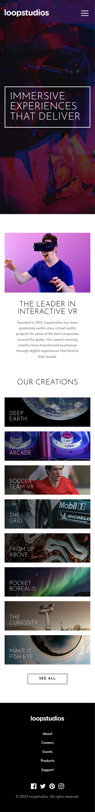

# Frontend Mentor - Loopstudios landing page solution

This is a solution to the [Loopstudios landing page challenge on Frontend Mentor](https://www.frontendmentor.io/challenges/loopstudios-landing-page-N88J5Onjw). Frontend Mentor challenges help you improve your coding skills by building realistic projects.

## Table of contents

- [Overview](#overview)
  - [The challenge](#the-challenge)
  - [Screenshot](#screenshot)
  - [Links](#links)
- [My process](#my-process)
  - [Built with](#built-with)
  - [What I learned](#what-i-learned)
  - [Useful resources](#useful-resources)
- [Author](#author)

## Overview

### The challenge

Users should be able to:

- View the optimal layout for the site depending on their device's screen size
- See hover states for all interactive elements on the page

### Screenshot

#### Desktop Screenshot

#### Mobile Screenshot

### Links

- Solution URL: [Add solution URL here](https://your-solution-url.com)
- Live Site URL: [https://yogskr-loopstudios.vercel.app/](https://yogskr-loopstudios.vercel.app/)

## My process

### Built with

- Semantic HTML5 markup
- CSS Flexbox
- CSS Grid
- Mobile-first workflow
- [React](https://react.dev/) - JavaScript library
- [Tailwind CSS](https://tailwindcss.com/) - CSS framework
- [Vite](https://vitejs.dev/) - for development environment

### What I learned

Loopstudios Landing Page is my first React project. In this project, I use Vite for the development environment. As for the styling, I use Tailwind CSS.

Building Loopstudios Landing page is quite challenging since I require good understading of the fundamentals, such as HTML, CSS, and JavaScript. I also need to implement my understanding of React.

The most challenging part of this project is to create a responsive functionalities, such as navigation bar and button. I need to implement React Hook `useState`, `useEffect`, and `useRef` to achieve the expected outcome.

Styling using Tailwind CSS also requires a good attention of details since there are various properties to be implemented in `className`.

### Useful resources

I mostly look up for the official documentation while building the project. The following is a list of the resources:

- [React Documentation](https://react.dev/learn)
- [Vite Documentation](https://vitejs.dev/guide/)
- [Tailwind CSS Documentation](https://tailwindcss.com/docs/installation)

## Author

- Website - [Yoga Krisanta](https://yogskr.github.io/personal-website)
- Frontend Mentor - [@yogskr](https://www.frontendmentor.io/profile/yogskr)
- GitHub - [@yogskr](https://www.github.com/yogskr)
- Twitter - [@yogskr\_](https://www.twitter.com/yogskr_)
